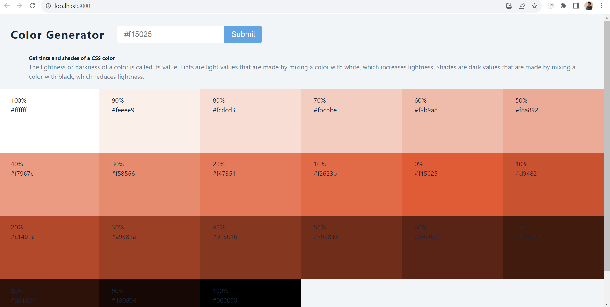

### Overview
Color shades and tints generator with the help of values.js

## Concepts used
1. Array join() method
2. Array spread operator
3. toString() method to get hex value

## Values JS

[values.js](https://github.com/noeldelgado/values.js)

## Final UI
