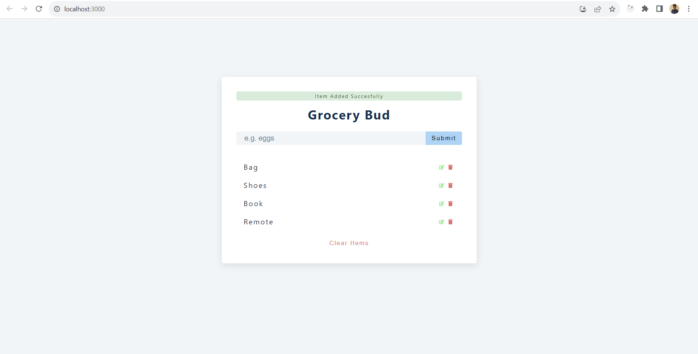

## Overview
Grocery list

## Concepts Used
1. Array find() method to find specific item in the array
2. Generating uniqe id using new Date().getTime().toString()
3. Use of local storage to persist data
4. Custom alert message 
5. Use of setTimeout()

## Final UI
